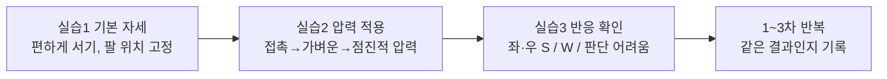
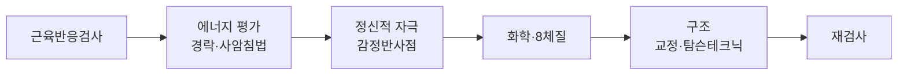

## 1. 강의 개요

1강의 목표는 "강한 힘"이 아니라 "같은 조건에서 반복 가능한 근육반응검사"의 기본기를 세우는 것입니다.

| 항목 | 내용 |
| --- | --- |
| 교육과정 | AK 자연치유요법 12주 과정 |
| 회차 | 제1강 (90분) |
| 주제 | 근육반응검사의 원리와 기본 검사법 |
| 강사 / 기관 | 고성윤 / AK 자연치유센터 |
| 자료 | 학생용 원고 6쪽, 녹취 약 37분(원고 2쪽부터), 사암침법 혈위 카드 |

**1강 학습목표**

1. AK 근육반응검사의 기본 개념을 설명할 수 있다.
2. 근육의 강함과 약함을 일정한 방법으로 검사할 수 있다.
3. 검사자의 자세와 힘의 방향을 이해한다.
4. 검사 결과에 영향을 주는 기본 오류를 구분할 수 있다.
5. AK 자연치유요법의 전체 검사 흐름을 이해한다.

## 2. AK란 무엇인가 — 4대 영역

AK(Applied Kinesiology, 응용근신경학)는 근육 반응을 관찰해 몸의 기능적 상태를 평가하는 방법이며, 이 과정은 근육반응검사를 바탕으로 네 영역을 다룹니다.

| 순서 | 영역 | 살펴보는 것 | 이 과정의 특징 |
| --- | --- | --- | --- |
| ① | 에너지(Energy) | 경락과 관련된 반응 | 사암침법 혈위 카드와 연결 |
| ② | 정신(Mind) | 정서·정신적 자극에 따른 근육반응 변화 | 감정반사점 |
| ③ | 화학(Chemistry) | 음식·영양·체질 관련 반응 | **8체질과 연계**한 근육반응검사가 중심 |
| ④ | 구조(Structure) | 근육·관절·척추·골반 | 탐슨테크닉 등 구조적 접근 |

암기: **에너지 → 정신 → 화학 → 구조**. 네 영역은 서로 독립적이지 않고 영향을 주고받는다고 봅니다.

**원고 해설 — 표준 AK와의 차이.** Goodheart가 만든 표준 AK의 틀은 "건강의 삼각형(구조·화학·정신)" 3요소입니다. 이 과정은 여기에 에너지(경락)를 독립 영역으로 앞세운 4영역 구성입니다. 또 표준 AK에는 없는 8체질의학(권도원)과 사암침법을 결합한 한국식 변형 커리큘럼이라는 점을 알고 들으시면 좋습니다.

## 3. 근육반응검사의 원리 — 5대 원칙과 Strong/Weak

근육반응검사는 같은 자세·같은 방향·비슷한 압력에서 근육이 자세를 유지하는지를 관찰하는 방법이며, 핵심 공식은 **자세 + 방향 + 압력 + 반복성**입니다.

**5대 원칙 (원고)**

1. 정확한 자세 — 피검사자의 관절 위치와 검사 자세를 일정하게 유지
2. 일정한 힘 — 갑자기 세게 하지 않고 서서히 압력을 올림
3. 일정한 방향 — 매번 같은 방향으로 누름
4. 검사자의 자세 — 팔 힘만 쓰지 않고 안정된 몸 자세 유지
5. 좌우 비교 — 필요하면 같은 조건에서 좌우를 비교

**Strong과 Weak (원고 + 강의)**

| 구분 | 원고 정의 | 강의에서 말한 손의 느낌 |
| --- | --- | --- |
| Strong (S) | 압력을 가해도 자세를 비교적 안정적으로 유지 | 압력을 조금씩 올려도 "짱짱하게" 버팀 |
| Weak (W) | 같은 조건에서 자세를 못 유지하거나 반응이 뚜렷이 감소 | 일정한 압력을 계속 주면 **점점** 내려감, 버티는 지점에서 미세하게 흔들림·떨림 |

**강의 핵심 (00:00–05:30)**

- Weak은 "내가 세게 눌러서" 떨어지는 것이 아니라, 일정한 압력을 유지하면 버티지 못하고 서서히 내려가는 것입니다.
- 떨어지는 근육도 피검사자가 힘을 쓰면 잠깐 버티는 듯 보이므로, 순간이 아니라 몇 초간의 변화를 봅니다.
- 강사는 삼각근(녹취상 "전·중삼각근")으로 시연했고, 차이는 "아주 약간"이라 스스로 미세한 차이를 감지하는 훈련이 필요하다고 했습니다.
- 원고 경고: **Strong ≠ 건강, Weak ≠ 질병.** 근육반응검사는 의학적 진단을 대신하지 않습니다.

## 4. 실습 절차와 강의 시연 포인트

실습은 "기본 자세 → 압력 적용 → 반응 확인" 3단계이고, 강의는 여기에 혼자 연습하는 법과 검사 횟수 요령을 더했습니다.

원고의 실습 기록지(1·2·3차 좌우 기록, 반복성 체크)를 그대로 쓰면 됩니다.

**혼자 연습하는 법 (02:30–08:00)**

- 자기 손가락으로 하는 자가검사로 연습합니다. 먼저 "힘 빼라" 신호와 "힘 줘라" 신호를 정해 두고, 각각에서 떨어짐과 버팀이 분명히 구분되는지 확인합니다.
- 강사: 신호는 "설정하기 나름"이며, 같은 동작도 "힘 줘라"로 설정하면 강해진다.
- 고수와 하수의 차이: 고수는 신호를 정한 뒤 **다 잊고** 검사한다. 결과를 예상하고 하면 안 된다.
- 이것이 확실해지면 "80%는 된 것"이라고 했습니다.

**검사 횟수·간격 (19:55–21:10, 질의응답)**

- 1·2·3차는 텀 없이 바로 이어서 해도 된다. 단, 피곤하거나 집중이 안 될 때는 하지 않는 것이 낫다.
- 처음에는 한 사람을 두고 결과가 일정하게 나올 때까지 계속 반복한다.
- 레이저침을 쓸 경우, 각 체질 처방을 먼저 자기 몸에 넣어 보며 연습하라고 했습니다.

**검사가 헷갈릴 때 (13:15–16:20)**

- 결과가 애매하면 물 한 잔 마시고 다시 합니다. 수분 부족이 원인일 수 있다는 설명입니다.
- 수분 검사·염분 검사를 따로 하는 방법도 언급됐으나 녹취가 불분명해 동작은 다음 시간에 확인이 필요합니다.

## 5. 검사에서 자주 발생하는 오류

정확한 검사의 조건은 "검사 조건의 표준화 + 반복 확인"이며, 오류는 검사자 쪽과 피검사자 쪽으로 나뉩니다.

| 검사자의 오류 | 피검사자의 오류 |
| --- | --- |
| 너무 강하게 누른다 | 검사 전에 지나치게 힘을 준다 |
| 갑자기 힘을 준다 | 몸 전체를 이용해 버틴다 |
| 매번 다른 방향으로 누른다 | 검사 자세가 계속 변한다 |
| 검사자의 자세가 흔들린다 | 검사 방법을 이해하지 못한 채 실시한다 |
| **결과를 예상하고 검사한다** | |

**강의에서 덧붙인 변수**

- 검사자 컨디션: 내가 피곤하면 상대가 상대적으로 강하게 느껴질 수 있다 (12:30).
- 압력 세기: 강사는 "살짝 눌러도 감이 오지만" 실제로는 세게 누른다. 특히 의심하는 태도의 피검사자는 세게 눌러야 정확하다고 했습니다 (06:04–06:30).
- 힘주는 "척"만 하고 실제로 버티지 않는 피검사자도 있다 (12:17).

원고의 "결과를 예상하고 검사한다"는 오류는 8장 비판적 검토에서 다시 다룹니다. 이 과정 전체에서 가장 중요한 오류입니다.

## 6. 전체 검사 흐름, 8체질 연결, 사암침법 카드

AK 자연치유요법은 근육반응검사를 도구로 4영역을 차례로 평가·적용한 뒤 재검사로 변화를 확인하는 구조입니다.

**8체질 검사 단계 (원고 9장)**

사상체질 관련 경혈 → 8체질 관련 경혈 → 모혈 → 감정반사점 → 대리검사. 일반 8체질의학은 맥진으로 판별하지만, 이 과정은 근육반응검사를 반복해 판별합니다. 한 번의 반응이 아니라 같은 결과가 반복되는지를 봅니다.

**강의에서 든 예 (24:00–26:00)**

- 위의 모혈에서 검사해 근육이 떨어지면 토음체질로 본다.
- 토음체질은 위가 가장 강한 체질이다. 단, "강한 것"과 "항진"은 다르다. 에너지가 적정선을 넘어 항진되면 낮춰야 한다.
- 위는 감정에 가장 민감한 장기라서, 위가 균형을 잡으면 감정도 어느 정도 안정된다는 설명.

**사암침법 Sedation(승격/실증치료) 카드 읽는 법**

강의에서 스트레스 반응 → 위 실증 → 사암침법 위승격을 찾아가는 시연이 있었습니다 (27:00–31:15). 카드의 위 줄이 그 처방입니다.

| 장부 | 보(補) | 사(瀉) |
| --- | --- | --- |
| 위 (시연 예) | 임읍↓, 함곡↓ | 상양↑, 여태↑ |

- 사암침법: 오행 상생·상극으로 두 혈을 보하고 두 혈을 사하는 한국 고유의 침법. 사암도인이 창안했다고 전해집니다.
- 이 과정은 침 대신 **레이저침**으로 자극합니다.
- 화살표 = 자극 방향. 기준 자세는 **두 팔을 머리 위로 든 자세**입니다. 이때 손의 음경락·발의 음경락은 위로, 손의 양경락·발의 양경락은 아래로 흐릅니다.
- 흐름 방향으로 자극하면 보, 반대 방향이면 사입니다. 그래서 같은 소부라도 올리는 소부와 내리는 소부가 있습니다.
- 카드 전체를 외울 필요는 없고, 보면서 하라고 했습니다. 경혈은 약 60개이며 자기 몸에 계속 해 보면 익혀진다고 했습니다.

## 7. 원고에 없던 강의 내용

녹취의 절반가량은 원고에 없는 응용·사례·질의응답이었습니다. 시간 순으로 정리합니다.

| 시각 | 내용 |
| --- | --- |
| 07:50–09:50 | 근육검사로 테이핑 방향까지 정한다. 라운드숄더, 틀어진 부위에 붙일 방향·당길 방향을 검사로 찾아 한 장만 붙인다. |
| 09:50–12:00 | 장애인체전에서 배드민턴 트레이너의 "씹히는" 통증을 햄스트링 문제로 찾아 풀어준 사례. 교과서 루틴이 아닌 **개인 맞춤 처치**가 장점이라고 강조. |
| 12:50–13:15 | Strong일 때와 Weak일 때 접촉의 느낌이 다르다. 악수할 때 느낌처럼 그 감을 빨리 익혀야 한다. |
| 14:15–15:50 | 물 컵을 쥐고 "물을 보충하라"고 말하면 근육이 강해지는 시연. 강사는 "말에 능력이 있다"는 신앙적 설명을 곁들임. |
| 17:20–19:50 | 8체질의 장점 주장: 성격, 아플 곳 예측, 운동 종목·포지션 적성, 마라톤 기록 한계까지 알 수 있다. |
| 21:20–22:35 | 근육검사는 형태로 나타나기 전 단계도 잡을 수 있지만, 질병을 단정하면 오해와 충돌이 생기니 절제하라. |
| 22:35–24:00 | (질문) "AK는 몸의 근육 지도를 발견한 의학"이라는 표현이 맞나? → 강사: 근육 자체의 틀어짐을 보는 게 아니라 근육을 **검사 도구**로 쓰는 것. |
| 24:30–24:50 | 예/아니오 질문으로 검사하는 방식 시연 ("암이 있습니까" → 경락별로 위치 찾기). |
| 26:00–27:30 | 스트레스 검사 후, 해결책을 예/아니오로 고르는 시연: 정신요법·차크라·음악·수면 → 모두 아니고 사암침법 → 위 경락 실증 → 사법. |
| 31:30–33:10 | 다음은 8체질 검사 실습. 핵심은 약 5주면 배우고 나머지는 보강. 선교지에 곧 가니 바로 쓸 수 있는 것부터. |
| 33:10–36:30 | 준비물: 레이저침, 테이핑, 액티베이터(교정기). 액티베이터는 강도 조절이 되는 정품을 권하고, 강도 조절이 안 되는 저가 중국산은 피하라. |
| 36:30–37:10 | 액티베이터로 골반교정하는 방법 예고. |

**녹취 품질 메모:** 자동 음성인식(소형 모델)이라 용어 오인식이 있었습니다. 문맥과 카드로 보정한 것: 사음침법→사암침법, 이목→임읍, 한곡→함곡, 상향→상양, 연분→염분. 액티베이터 제조사 이름은 불분명하니 강사께 링크를 다시 받으시길 권합니다.

## 8. 비판적 검토 — 근거 수준과 주의점 {: .critical }

결론부터: 1강의 **검사 자세·압력·방향을 표준화하라는 기술 원칙은 타당**하지만, 근육반응으로 체질·질병·해결책을 "읽어낸다"는 부분은 이중맹검 연구에서 우연 수준을 넘지 못했습니다.

**1. 강의 안에 이미 답이 있습니다.** 강사는 신호를 "설정하기 나름"이라 했고, 스트레스 검사에서 설정을 뒤집자("스트레스가 있으면 세진다") 결과도 뒤집혔습니다. 결과가 설정을 따른다면, 그 검사는 몸보다 검사자·피검사자의 기대를 측정하고 있을 가능성이 큽니다. 이것이 관념운동효과(ideomotor effect)이고, 원고가 "결과를 예상하고 검사한다"를 오류로 꼽는 이유이기도 합니다.

**2. 맹검 연구 결과.** 독성 용액과 식염수 병을 무작위로 쥐게 한 2014년 이중맹검 연구(51명)에서 AK 검사자의 적중률은 53%로 우연 수준이었습니다 ([PubMed](https://pubmed.ncbi.nlm.nih.gov/24607076/), [결과 요약](https://www.fundacaobial.com/media/3394/44_a-study-to-assess-the-validity-of-applied_bolsa167-06_03012014.pdf)). 1988년 영양상태 검사 연구에서는 숙련 검사자 3명끼리도 결과가 일치하지 않았습니다 ([PubMed](https://pubmed.ncbi.nlm.nih.gov/3372923/)).

**3. 구체적으로 조심할 대목**

- 의심하는 사람은 더 세게 누른다: 압력이 사람마다 달라지면 원칙 ②③을 스스로 깨는 셈입니다.
- 물 컵 시연: 검사자와 피검사자가 모두 무엇을 쥐었는지 아는 상태의 시연이라 기대 효과를 배제할 수 없습니다.
- "암이 있습니까" 예/아니오 검사: 원고의 "근육반응검사 결과만으로 질병을 진단하지 않는다"와 정면으로 충돌합니다. 선교지에서는 "없다"는 결과가 병원 방문을 늦추게 할 수 있어 가장 위험한 사용법입니다.
- 8체질의 운동 포지션·마라톤 한계 판별: 이를 뒷받침하는 연구는 찾기 어렵습니다. 8체질의학 자체도 판별의 일치도가 논쟁 중인 분야입니다.

**4. 제안 — 스스로 확인해 보는 맹검 연습.** 이 과정이 강조하는 "반복성"을 한 단계 더 엄격하게 해보는 방법입니다. 같은 모양의 불투명 컵 두 개에 물/빈 컵(또는 소금물/맹물)을 다른 사람이 무작위로 넣고, 검사자와 피검사자 모두 모르는 상태에서 20회 검사해 적중률을 기록합니다. 몸이 정말 반응한다면 50%를 뚜렷이 넘어야 합니다.

**선교지 활용 관점:** 접촉과 대화의 출발점, 테이핑·스트레칭 같은 구조적 도움은 그대로 가치가 있습니다. 다만 결과를 "진단"이 아니라 "몸의 반응을 함께 살펴보는 경험"으로 설명하고, 질병 여부는 반드시 의료기관으로 연결하는 선을 지키시길 권합니다.

## 9. 확인문제 모범답안 · 꼭 기억할 5가지 · 다음 시간

**오늘의 핵심 한 문장:** "좋은 근육반응검사의 출발점은 강한 힘이 아니라 정확하고 반복 가능한 검사이다."

**꼭 기억할 5가지**

1. 근육반응검사는 단순한 힘겨루기가 아니다.
2. 검사 자세와 힘의 방향을 일정하게 유지한다.
3. 갑자기 강한 힘을 주지 않는다.
4. 한 번의 결과보다 반복되는 반응을 중요하게 본다.
5. 근육반응검사 결과만으로 질병을 진단하지 않는다.

**확인문제 모범답안**

1. **AK의 영어 명칭:** Applied Kinesiology (응용근신경학).
2. **4대 영역 순서:** 에너지(Energy) → 정신(Mind) → 화학(Chemistry) → 구조(Structure).
3. **일정하게 유지할 조건:** 검사 자세(관절 위치), 힘의 방향, 압력(서서히 증가), 검사자의 안정된 자세, 좌우 비교 시 동일 조건.
4. **Strong과 Weak:** Strong은 압력을 가해도 자세를 안정적으로 유지하는 반응, Weak은 같은 조건에서 자세를 유지하지 못하거나 반응이 뚜렷이 감소하는 반응. Strong이 건강을, Weak이 질병을 뜻하지는 않는다.
5. **반복 검사가 중요한 이유:** 한 번의 반응은 압력·방향·컨디션·기대 같은 오류에 쉽게 흔들리므로, 같은 조건에서 같은 결과가 반복될 때만 의미 있는 반응으로 본다.

**다음 시간 — 제2강: 근육반응검사 심화와 8체질 검사의 기초**

- 기본 근육반응검사 반복 연습, 8체질 판별 과정에 적용하는 단계.
- 강의에서 예고된 것: 8체질 검사 실습, 액티베이터 골반교정.
- 숙제: 자가검사 신호(힘 빼라/힘 줘라) 구분 연습, 실습 기록지 1~3차 작성.
