## 1. 강의 개요

2강은 1강에서 익힌 근육반응검사를 **8체질 판별**에 적용하는 회차입니다. 새로 외울 것은 **12경맥 오수혈(60개)** 이고, 이것으로 만든 검사 단계를 순서대로 실습합니다.

| 항목 | 내용 |
| --- | --- |
| 교육과정 | AK 자연치유요법 12주 과정 |
| 회차 | 제2강 |
| 주제 | AK 근육반응검사를 이용한 8체질 판별 |
| 강사 / 기관 | 비공개 (개인 학습용 정리) |
| 자료 | 학생용 교재 사진 5장(오수혈표, 1차·2차 검사표와 그림, 모혈표, 체크리스트, 복습문제), 녹취 약 66분 |

**2강 학습목표 (교재 A4-1)**

1. 검사 전 Switch On과 지표근육(IM)의 의미를 이해한다.
2. 12경맥 오수혈을 체질별 보·사 검사와 연결한다.
3. 1차 금·목·토·수 체질군 검사와 2차 8체질 검사를 구분한다.
4. 모혈 및 추가 검사를 이용해 반복·교차 확인한다.

교재 첫 쪽에 "교육용 체질 판별 절차이며 질병의 의학적 진단을 대신하지 않는다"는 문구가 있습니다.

**녹취 메모:** 녹취는 자동 음성인식이고 화자 구분이 섞여 있어 용어 오인식이 많습니다(예: 첩형골→접형골, 삼친법→사암침법, 모열→모혈, 중안→중완, 서상→소상). 교재와 문맥으로 보정했고, 교재로 확인되지 않는 부분은 "불분명"으로 표시했습니다. 녹취는 01:06:23에서 문장 중간에 끊겨 있습니다.

## 2. 전체 흐름

교재가 제시한 순서는 다음과 같습니다. 강사는 이를 "1차 → 2차 → 모혈(3차) → 감정반사점 → 대리검사"로 설명했고, 중간에 결과가 어긋나면 처음으로 돌아갑니다.

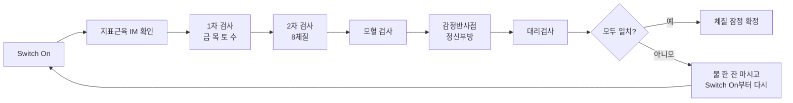

## 3. Switch On과 지표근육(IM)

교재: 검사 전에 피검사자의 반응 상태와 에너지 균형을 점검하고, 강하면서 기능적으로 문제가 없는 근육을 지표근육으로 정해 Strong/Weak 반응의 일관성을 확인합니다. 교육에서는 전삼각근을 주로 씁니다.

**강의에서 덧붙인 것 (06:03–08:30, 31:07–31:29)**

- **Switch On:** 상하·좌우·앞뒤의 균형을 맞추는 준비 동작입니다. **피검사자만이 아니라 검사자도 똑같이 해야** 합니다. 지난 시간 시연한 것이 이것입니다.
- **지표근육 후보:** 손가락 근육, 전삼각근, 중삼각근, 다리 근육. 다리는 불편하고, 전삼각근이 가장 하기 편해서 많이 쓴다고 했습니다. 빠르게 해야 하는 치료사에게는 손가락 근육이 가장 편하지만 훈련이 필요하고, 세미나에서는 이를 잘 가르쳐 주지 않는다고 했습니다.
- **헷갈릴 때:** 물 한 잔 마시고 다시 합니다. 수분 보충과 염분 부족 여부도 체크할 수 있다고 했습니다(구체적인 염분 검사 동작은 설명하지 않았습니다).

## 4. 12경맥 오수혈

오수혈은 각 경맥마다 **정(井)·형(滎)·수(兪)·경(經)·합(合)** 다섯 혈로, **팔꿈치와 무릎 아래**에만 있습니다. 12경맥 × 5 = 60개이므로 365개 혈을 다 외울 필요가 없고, 순서만 외우면 됩니다.

| 경맥 | 정 | 형 | 수 | 경 | 합 |
| --- | --- | --- | --- | --- | --- |
| 수태음폐경 | 소상 | 어제 | 태연 | 경거 | 척택 |
| 수양명대장경 | 상양 | 이간 | 삼간 | 양계 | 곡지 |
| 족양명위경 | 여태 | 내정 | 함곡 | 해계 | 족삼리 |
| 족태음비경 | 은백 | 대도 | 태백 | 상구 | 음릉천 |
| 수소음심경 | 소충 | 소부 | 신문 | 영도 | 소해 |
| 수태양소장경 | 소택 | 전곡 | 후계 | 양곡 | 소해 |
| 족태양방광경 | 지음 | 족통곡 | 속골 | 곤륜 | 위중 |
| 족소음신경 | 용천 | 연곡 | 태계 | 복류 | 음곡 |
| 수궐음심포경 | 중충 | 노궁 | 대릉 | 간사 | 곡택 |
| 수소양삼초경 | 관충 | 액문 | 중저 | 지구 | 천정 |
| 족소양담경 | 족규음 | 협계 | 족임읍 | 양보 | 양릉천 |
| 족궐음간경 | 대돈 | 행간 | 태충 | 중봉 | 곡천 |

**읽는 법과 암기 요령**

- 같은 "소해"가 두 곳에 있습니다. 심경의 소해와 소장경의 소해는 **이름만 같고 위치와 한자가 다릅니다**(13:22–14:03). 심경 소해는 팔꿈치 안쪽, 소장경 소해는 바깥쪽이라고 했습니다. 표준 위치로 그리면 둘 다 팔꿈치 안쪽(새끼손가락 쪽)이고 앞면·뒷면이 다릅니다. 강사가 말한 "바깥쪽"은 표준 위치와 다르게 들리므로 **다음 시간에 확인이 필요합니다**(아래 그림 참고).
- 암기법: 폐경이면 "소상, 어제, 태연, 경거, 척택"을 박자로 몇 번 읊으며 짚어 가면 손가락이 위치를 기억합니다. 헷갈리면 순서를 세어 가며 다시 찾으면 됩니다(09:26–10:47).
- **스티커 연습:** 혈자리 위치만 익히는 단계에서는 스티커를 붙여 보는 연습이 가장 좋다고 했습니다. 하루 두 번씩만 붙여도 된다고 했습니다(10:47–11:05, 50:01).
- 오수혈은 경락 전체의 길이 아니라 그중 5개 지점만 보는 것입니다. 폐경은 중부에서 시작해 소상에서 끝나는 긴 경로이고, 오수혈은 팔 아래쪽 5개만 봅니다(58:36–59:31).
- 비경의 음릉천은 양릉천과 반대 위치입니다. 강사는 침을 대각선으로 놓는다고 했습니다(12:23–12:37).

**경맥 이름과 장부 (14:40–19:30, 질의응답)**

| 오행 | 장(藏, 찬 것) | 부(府, 빈 것) |
| --- | --- | --- |
| 목(木) | 간 | 담 |
| 화(火) | 심 · 심포 | 소장 · 삼초 |
| 토(土) | 비 | 위 |
| 금(金) | 폐 | 대장 |
| 수(水) | 신(콩팥) | 방광 |

- 짝이 되는 장과 부의 관계를 **표리 관계**라고 합니다. 폐-대장, 심-소장, 심포-삼초, 간-담, 비-위, 신-방광입니다. 강사는 간이 안 좋으면 담도 당연히 안 좋다는 식으로 설명했습니다.
- 삼초는 상초·중초·하초로, 형태가 없는 부입니다.
- 심포는 "심장을 싸고 있는 막"이라고 설명했고, 강사 본인은 이를 "관상동맥"으로 이해한다고 했습니다. 이것은 강사의 개인적인 이해 방식이고, 표준 해부학 용어가 아닙니다.
- **음양과 방향:** 음경은 아래에서 위로, 양경은 위에서 아래로 흐릅니다(26:44–27:35). 1강의 기준 자세(두 팔을 머리 위로 든 자세)와 같은 말입니다. 간경은 대돈→행간→태충→중봉→곡천으로 아래에서 위로 흐르는 음경이고, 대장경은 상양에서 시작해 내려오는 양경입니다.

**경맥별 오수혈 위치 그림**

아래 12장은 경맥마다 오수혈 5개만 표시한 개략도입니다. 번호는 정(1)·형(2)·수(3)·경(4)·합(5) 순서이고, 팔은 오른팔, 다리는 오른다리 기준입니다. 팔과 다리는 길어서 중간을 줄이고, 팔꿈치·무릎 쪽과 손목·발목 쪽을 확대해 그렸습니다. 1촌은 본인 엄지손가락 너비 정도의 길이입니다.

> **안내:** 공개된 자료 중에서 "경맥마다 오수혈 5개만 표시한" 그림은 찾지 못해, 표준 경혈 위치 설명을 바탕으로 직접 그린 개략도입니다. 실제 몸의 비율과 다르고, 이번에 교재나 사암침법 책과 대조하지는 못했습니다. 침이나 자극에 쓰기 전에 교재 그림, 강사 자료와 꼭 비교하세요.

### 수태음폐경 — 소상 · 어제 · 태연 · 경거 · 척택


소상은 엄지 안쪽(몸 쪽) 손톱 모서리, 어제는 엄지 아래 불룩한 곳(엄지 손허리뼈 가운데), 태연은 손목 주름에서 맥이 뛰는 곳입니다.

### 수양명대장경 — 상양 · 이간 · 삼간 · 양계 · 곡지


손등 쪽 그림이라 엄지가 오른쪽에 있습니다. 양계는 엄지를 젖힐 때 손목 엄지 쪽에 오목하게 들어가는 곳입니다.

### 족양명위경 — 여태 · 내정 · 함곡 · 해계 · 족삼리


발등 쪽 그림입니다. 여태는 둘째발가락의 셋째발가락 쪽 발톱 모서리입니다.

### 족태음비경 — 은백 · 대도 · 태백 · 상구 · 음릉천


안쪽에서 본 그림이라 발끝이 왼쪽입니다. 대도와 태백은 엄지발가락 뿌리 관절의 앞과 뒤입니다.

### 수소음심경 — 소충 · 소부 · 신문 · 영도 · 소해


손바닥 쪽 그림입니다. 소해는 팔꿈치 주름의 안쪽(새끼손가락 쪽) 끝입니다.

### 수태양소장경 — 소택 · 전곡 · 후계 · 양곡 · 소해


손등 쪽 그림입니다. 소장경의 소해는 팔꿈치 뒤쪽, 뼈 끝(주두)과 안쪽 뼈 사이로 심경 소해와 앞뒤가 다릅니다.

### 족태양방광경 — 지음 · 족통곡 · 속골 · 곤륜 · 위중


바깥쪽에서 본 그림이라 발끝이 오른쪽입니다. 위중은 무릎 뒤 오금 주름의 가운데입니다.

### 족소음신경 — 용천 · 연곡 · 태계 · 복류 · 음곡


맨 아래 작은 그림은 발바닥입니다. 용천은 발가락을 굽히면 오목해지는, 발바닥 앞 1/3 지점입니다.

### 수궐음심포경 — 중충 · 노궁 · 대릉 · 간사 · 곡택


손바닥 쪽 그림입니다. 노궁은 주먹을 쥘 때 가운뎃손가락 끝이 닿는 곳입니다.

### 수소양삼초경 — 관충 · 액문 · 중저 · 지구 · 천정


손등 쪽 그림입니다. 정신부방으로 쓴다고 한 관충과 중저가 여기에 있습니다.

### 족소양담경 — 족규음 · 협계 · 족임읍 · 양보 · 양릉천


발등 쪽 그림입니다. 양릉천은 종아리뼈 머리의 앞아래 오목한 곳입니다.

### 족궐음간경 — 대돈 · 행간 · 태충 · 중봉 · 곡천


발등 쪽 그림입니다. 곡천은 무릎을 굽혔을 때 오금 주름 안쪽 끝이라 앞에서 본 그림에서는 가장자리에만 표시했습니다.

## 5. 1차 검사 — 금·목·토·수 체질군

1차는 사상체질에 해당하는 **네 체질군**을 가르는 단계입니다. 강사는 금=태양인, 목=태음인, 토=소양인, 수=소음인으로 대응시켰습니다(24:39–25:02).

| 체질군 | 보(補) | 사(瀉) |
| --- | --- | --- |
| 금체질 | 폐木(소상) 보 | 간金(중봉) 사 |
| 목체질 | 폐木(소상) 사 | 간金(중봉) 보 |
| 토체질 | 비水(음릉천) 보 | 신土(태계) 사 |
| 수체질 | 비水(음릉천) 사 | 신土(태계) 보 |

교재: 각 조합을 적용한 뒤 동일한 지표근육으로 반응을 비교하며, **한 번의 반응으로 확정하지 않습니다.**

**보와 사 (24:39–27:35)**

- **보**는 경락이 흐르는 방향으로, **사**는 반대 방향으로 자극하는 것입니다. 소상 보는 폐경의 흐름을 따라 소상으로 향하고, 소상 사는 그 반대입니다.
- 침을 놓을 때는 교재 그림의 화살표 방향대로 하면 됩니다.

**강사의 단순화: "사상체질혈" (28:44–29:23)**

강사는 보·사를 모두 쓰면 헷갈리므로, 개인적으로는 **보만 쓴다**고 했습니다. 이 용어는 강사가 직접 붙인 이름이고 "어디서 얘기하진 않았다"고 했습니다. 이 방식에서 네 혈은 다음과 같습니다.

| 이 혈을 보했을 때 힘이 세지면 | 체질군 |
| --- | --- |
| 소상 보 | 금 |
| 중봉 보 | 목 |
| 음릉천 보 | 토 |
| 태계 보 | 수 |

**검사하는 법 (27:52–31:07)**

- 근육이 "세진다"는 것은 **세진다고 미리 설정해 두어야** 합니다. 설정이 약해진다면 약해지는 것이 맞는 반응이라고 했습니다.
- 마음속으로 "1차 합니다"라고 말하고 검사하며, 한 번에 **한 가지에서만** 세진다고 했습니다. 두 개가 나오지는 않는다고 했습니다.
- 강사는 "내 개념이 확실히 서 있으면 환자에게 정보가 전달되어 몸이 반응한다"고 설명했습니다(29:54–30:28). 이 설명은 9장에서 따로 검토합니다.

## 6. 2차 검사 — 8체질

1차에서 체질군이 나오면 **양체질인지 음체질인지**만 구분하면 됩니다. 예를 들어 수체질이 나왔다면 수양체질과 수음체질 중에서 가립니다(31:37–32:26). 바로 2차부터 시작할 수도 있고, 그때는 1차 결과를 기억하되 잊고 검사합니다.

**금·목 체질 (교재 A4-5)** — 신장경 혈을 씁니다.

| 체질 | 보·사 ① | 보·사 ② (표) | 보·사 ② (그림) |
| --- | --- | --- | --- |
| 금양체질 | 신土(태계) 사 | 신水(음곡) 보 | 신木(용천) 보 |
| 금음체질 | 신金(복류) 사 | 신火(연곡) 보 | 신火(연곡) 보 |
| 목양체질 | 신土(태계) 보 | 신水(음곡) 사 | 신木(용천) 사 |
| 목음체질 | 신金(복류) 보 | 신火(연곡) 사 | 신火(연곡) 사 |

**교재 내부 불일치:** 금양과 목양의 ②번이 표에는 음곡(水)으로, 같은 쪽의 그림에는 용천(木)으로 적혀 있습니다. 금음·목음은 표와 그림이 같습니다. 어느 쪽이 맞는지 **다음 시간에 강사께 확인이 필요합니다.** 표준 오수혈 체계로 보면 음곡은 신장경 합혈(水), 용천은 정혈(木)이라 둘은 서로 다른 혈입니다.

**토·수 체질 (교재 A4-6)** — 폐경 혈을 씁니다.

| 체질 | 보·사 ① | 보·사 ② |
| --- | --- | --- |
| 토양체질 | 폐火(어제) 사 | 폐水(척택) 보 |
| 토음체질 | 폐土(태연) 사 | 폐木(소상) 보 |
| 수양체질 | 폐火(어제) 보 | 폐水(척택) 사 |
| 수음체질 | 폐土(태연) 보 | 폐木(소상) 사 |

**표에서 눈에 띄는 규칙:** 금체질과 목체질은 같은 혈에서 보와 사만 뒤집힙니다(금양↔목양, 금음↔목음). 토체질과 수체질도 마찬가지입니다(토양↔수양, 토음↔수음). 1차 표도 같은 구조입니다.

**검사하는 법 (32:59–37:50)**

- 8가지 중 한 가지에서만 힘이 세진다고 했습니다. 보·사를 한꺼번에 섞으면 헷갈리므로 **한 혈씩** 자극합니다.
- 강사는 이 단계도 보만 쓴다고 했습니다(34:11). 표에서 보만 뽑으면 금음=연곡, 목양=태계, 목음=복류, 토양=척택, 토음=소상, 수양=어제, 수음=태연이고, 금양은 표대로면 음곡, 그림대로면 용천입니다. (이 정리는 제가 표에서 뽑은 것이고, 강사가 혈 이름을 하나씩 말한 것은 아닙니다.)
- 레이저침을 쓴다면 혈 하나에 **약 10초** 조사합니다. 레이저가 없으면 손으로 그 혈을 자극해도 된다고 했습니다.
- **어디서 근육을 검사하나:** 혈자리 위에서가 아니라, 자극을 준 뒤 **인당(양 눈썹 사이)에 손을 대고** "이것이 효과가 있습니까"라고 묻는 방식으로 지표근육을 검사합니다. 강사는 정보를 손으로 주고받는 부위가 인당이라고 설명했습니다(36:21–37:14).
- **일치 조건:** 1차에서 수체질이 나왔다면 2차에서는 수양이나 수음만 나와야 합니다. 1차와 2차가 서로 이어지지 않으면 1차가 잘못된 것입니다(37:30–37:50).

## 7. 모혈 · 감정반사점 · 정신부방 · 대리검사

**모혈 검사 (교재 A4-7)** — 3차에 해당합니다.

| 체질 | 경락 | 모혈 | 위치 (강사 설명, 녹취 기준) |
| --- | --- | --- | --- |
| 금양 | 폐경 | 중부 | 녹취 불분명. 표준 위치는 쇄골 아래 바깥쪽, 첫째 갈비뼈 사이(아래 그림) |
| 금음 | 대장경 | 천추 | 배꼽 양옆 |
| 목양 | 간경 | 기문 | 젖꼭지에서 곧게 내려 7번 갈비뼈 부근 |
| 목음 | 담경 | 일월 | 기문 바로 아래 |
| 토양 | 비경 | 장문 | 옆구리, 갈비뼈 끝 부근 |
| 토음 | 위경 | 중완 | 명치와 배꼽 사이 중간 |
| 수양 | 신경 | 경문 | 옆구리 뒤쪽 갈비뼈 아래 |
| 수음 | 방광경 | 중극 | 치골 바로 위 |

- 강사가 모혈 그림 파일을 따로 보내 주겠다고 했으므로(54:41), 위치는 그림을 받은 뒤 보정해야 합니다. 아래 그림은 표준 위치로 직접 그린 것이므로, 받은 그림과 대조해 고쳐야 합니다.
- 강사는 해당 체질의 경락이 가장 "항진"된다고 설명했습니다(38:29). 1강에서 정리한 "강한 것과 항진은 다르다"와 같은 맥락입니다.
- **방향 주의:** 1차·2차는 "힘이 **세지는** 쪽"이 답이고, 모혈은 해당 혈에 손을 댔을 때 **근육이 떨어지는(약해지는) 쪽**이 답입니다(40:48–41:31, 1강 24:00 시연과도 일치). 방향이 반대라 헷갈리기 쉽습니다.

**모혈 위치 그림**

체질마다 모혈 1개만 표시했습니다. 몸 앞쪽에서 본 개략도이고, 양쪽에 있는 혈은 좌우 모두 표시했습니다. 위의 오수혈 그림과 같은 이유로 실제 몸의 비율과 다르며, 강사가 보내 주기로 한 모혈 그림을 받으면 대조가 필요합니다.

### 금양체질 — 폐경 모혈 중부


녹취에서 위치를 알아듣기 어려워 표준 위치로 그렸습니다. 가슴 위쪽 바깥, 쇄골 아래 첫째 갈비뼈 사이입니다.

### 금음체질 — 대장경 모혈 천추


배꼽에서 옆으로 2촌, 양쪽에 있습니다.

### 목양체질 — 간경 모혈 기문


젖꼭지 바로 아래입니다. 표준 위치는 6번과 7번 갈비뼈 사이로, 강의의 "7번 갈비뼈 부근"과 비슷합니다.

### 목음체질 — 담경 모혈 일월


기문 바로 아래 한 갈비뼈, 7번과 8번 갈비뼈 사이입니다.

### 토양체질 — 비경 모혈 장문


옆구리에서 11번 갈비뼈(뜬갈비뼈) 끝 아래입니다.

### 토음체질 — 위경 모혈 중완


명치와 배꼽의 가운데, 배꼽 위 4촌입니다. 몸 가운데 한 곳입니다.

### 수양체질 — 신경 모혈 경문


옆구리 뒤쪽, 12번 갈비뼈 끝 아래입니다. 몸 옆면에 있어서 앞에서 본 그림에는 가장자리에 표시했습니다.

### 수음체질 — 방광경 모혈 중극


배꼽 아래 4촌, 치골 위 모서리에서 1촌 위입니다. 몸 가운데 한 곳입니다.

**감정반사점과 정신부방 (교재 A4-8, 41:31–45:23)**

1. 양쪽 눈썹 위 중앙의 **감정반사점**에 손을 대고 지표근육을 검사합니다. 약해지면 감정 쪽에 문제가 있다는 뜻입니다.
2. 약해졌다면 그 체질의 **정신부방** 혈을 자극한 뒤 다시 검사합니다.
3. 근육이 다시 강해지면 그 체질이 맞다고 보고, 효과가 없으면 체질 판별이 틀린 것으로 봅니다.

**정신부방 메모**

- 정신부방으로는 관충과 중저를 많이 쓴다고 했습니다. 두 혈은 삼초경 혈이며 교재 오수혈표에 있습니다. 체질별 정신부방 표는 이번 교재에 없고, 소음·양체질에 따라 왼쪽·오른쪽을 구분한다는 설명은 녹취가 불분명합니다(42:17). **다음 시간 확인 필요.**
- 검사를 하는 주체는 계속 검사자이고, 판별을 연습하는 사람도 검사자입니다(45:09–45:23).

**대리검사 (교재 A4-8, 45:26–47:19)**

- **대리검사 1(제3자):** 제3의 사람이 피검사자의 손목을 잡은 채로 검사합니다.
- **대리검사 2(검사자):** 검사자 자신의 몸에 1차·2차·모혈을 대고 검사합니다.
- 강사는 직접검사와 대리검사를 곱해 **열 가지 이상**의 검사가 가능하다고 했습니다.
- 대리검사가 필요한 때는 직접검사가 어렵거나 추가 확인이 필요할 때입니다. 다리를 모았다 벌리는 등 몸을 움직이면 "정보가 지워진다"고 했고, 다리를 모은 자세로 그 자리에서 검사하라고 했습니다(46:17).

**확정과 중단 기준 (47:28–49:30)**

- 하나라도 서로 안 맞으면 물 한 잔 마시고 Switch On부터 처음부터 다시 합니다. 그래도 헷갈리면 며칠 쉬었다가 다시 합니다.
- 8체질 한의원에서는 보통 **세 번 이상 방문하고 마지막에 체질침의 효과까지 확인해 한 달**쯤 걸려 체질을 확정합니다. 강사는 이 방법이 5분 안에 열 가지를 검사해 빠르게 확정할 수 있는 점이 장점이라고 했습니다.
- 강사는 한의사의 진맥 판별이 정확해지려면 "20만 명", 논문 기준으로도 "7만 명 이상"을 봐야 70% 정확도가 나온다고 했고, AK 근육검사가 그 단점을 보완할 수 있을 거라고 생각한다고 했습니다.

**실습 체크리스트 (교재 A4-9):** Switch On → IM Strong/Weak 확인 → 1차 체질군 검사 → 2차 8체질 검사 → 모혈 교차검사 → 감정반사점/정신부방 → 필요 시 대리검사 → 반복 결과 기록.

## 8. 원고에 없던 강의 내용

| 시각 | 내용 |
| --- | --- |
| 00:01–05:30 | 접형골(관자놀이 부위의 뼈)은 머리뼈 대부분과 연결되어 있어 한 대 맞으면 머리 전체가 흔들린다고 설명. 액티베이터로 양쪽을 서로 밀어 보며 "한쪽을 누르면 반대쪽이 밀리는" 느낌을 확인. 골반은 세게, 머리는 아주 약하게 강도를 줄여 쓴다고 함. 경추 1번도 같은 방식으로 느껴진다고 함. (앞부분은 질의가 섞여 문맥이 불분명) |
| 07:22–07:35 | **사상체질에는 침법이 없고** 음식(또는 약)으로 치료하는 반면, 8체질에는 오수혈을 쓰는 침법이 있다고 설명. |
| 19:56–20:18 | 사암침법 책(얇은 책과 두꺼운 책)을 보내 줄 예정. 혈자리 위치가 책에 나와 있음. |
| 20:19–21:52 | 침 대신 레이저침. 8체질 침은 "유침"(오래 꽂아 두는 침)이 아니라 바로 빼는 방식이라 잘못 놓아도 해가 거의 없다고 설명. 일반 침은 경락이 한 바퀴 도는 약 30분 동안 꽂아 둔다고 함. |
| 21:57–24:09 | 레이저침 등 기기 구입에 관한 안내가 있었음(구입 조건 등 개인 사항은 생략). |
| 24:14–24:20 | 맞는 체질을 알아야 침을 정확히 놓을 수 있다는 흐름으로 1차 검사 설명 시작. |
| 50:15–51:07 | 혈자리 파일과 책 파일을 카톡으로 보내 줄 예정. |
| 51:15–52:36 | AK 기본 교과서는 원래 한 권을 세 권으로 나눈 것인데 너무 어렵다고 소개. 강사는 그 이론보다 자신의 방식이 효과가 더 좋다고 함. 에너지는 레이저침, 정신은 튜닝포크와 싱잉볼, 치료 우선순위는 경락으로 찾는다고 설명. (화학 부분 설명은 불분명) |
| 55:49–56:11 | 국제 AK 협회가 사암침법을 자기네 테크닉처럼 쓰는 것이 아쉽다는 말. 사암침법은 특허가 있는 것이 아니고 한국 전통 침법이라고 함. (이 주장은 확인하지 못함) |
| 56:17–57:05 | 사암침법의 **승격(실증 치료)과 정격(허증 치료)**. 어느 경락이 강한지 약한지를 보고 혈을 정하며, 보사는 8체질 침과 같다고 함. "이 둘만 알면 침 고수가 될 수 있다"고 함. |
| 57:41–58:33 | 사암침법 카드에 오수혈표를 넣은 이유: 혈자리 그림이 없어도 순서와 표만 있으면 혈을 바로 찾을 수 있게 하려는 것. |
| 59:50–01:00:46 | **액티베이터 매뉴얼**(골반부터 척추까지 전신 교정)이 따로 있고, 한 사람을 두고 시연해 보여 주면 신기하다고 함. "마사지로는 교정이 안 되고, 교정된 것처럼만 보인다"는 주장. |
| 01:02:40–01:03:09 | 문제의 종류를 에너지 → 정신 → 화학 → 구조 순으로 찾고, 마지막으로 **"치료 충분"**(치료가 충분한지)까지 검사한다. 이 순서는 기기에 기본 설정되어 있다고 함. |
| 01:03:09–01:04:06 | 에너지 문제가 나왔을 때 해결책을 근육검사로 고르는 방식: 레이저침, 8체질, 차크라, 에너지 젤, 홍삼, 근막 교정, 사암침법 중 무엇이 효과 있는지 하나씩 검사. |
| 01:04:06–01:05:30 | 장대 선수(장대높이뛰기로 보임)의 팔꿈치 통증 사례: 어깨를 비트는 동작이 원인이라 보고 어깨를 바로 한 채로 동작하게 했더니 통증이 사라짐. 아프다는 부위가 아니라 몸 전체의 비틀림을 본다는 예. |
| 01:05:51–01:06:23 | 실습을 많이 해야 하고 아이들이 연습 대상으로 가장 좋다고 함. |

**다음 강의까지:** 대화 내용으로 볼 때 다음 강의는 약 2주 뒤로 보입니다(47:28, 49:41). 그 사이 오수혈 암기와 스티커 연습, 1·2차 검사 반복 실습이 과제로 이어집니다. 3강 주제는 이번 녹취에서 확인되지 않았습니다.

## 9. 비판적 검토 — 근거 수준과 주의점 {: .critical }

결론부터: 오수혈표를 외우는 일과 검사 순서를 표준화하는 일은 문제가 없습니다. 그러나 **"근육 반응으로 8체질을 판별한다"는 핵심 주장은 이번 강의에서도 검증 가능한 형태로 제시되지 않았고**, 1강에서 확인한 맹검 연구 결과가 그대로 적용됩니다. 이 장은 특정 개인이 아니라 **방법의 근거 수준**을 평가합니다. 새 출처는 이번에 따로 검색하지 않았고, 아래 근거는 1강에서 실제로 열어 본 두 건입니다.

**1. 결과가 "설정"에 좌우됩니다.** 강의에서는 "세진다고 설정해야 한다. 약하다고 설정하면 약한 게 맞는 반응"이라고 설명했습니다(27:52). 1강의 "신호는 설정하기 나름"과 같은 이야기입니다. 몸의 반응이 아니라 설정과 기대가 결과를 정한다면, 같은 근육 반응이 어떤 체질로도 읽힐 수 있습니다. 1강에서 인용한 맹검 연구(2014년, 51명, 적중률 53%, [PubMed](https://pubmed.ncbi.nlm.nih.gov/24607076/))와 숙련 검사자 3명의 결과가 일치하지 않았던 1988년 연구([PubMed](https://pubmed.ncbi.nlm.nih.gov/3372923/))는 이 의심을 뒷받침합니다.

**2. "정보 전달"은 확인할 수 없는 설명입니다.** "검사자의 개념이 확실하면 피검사자에게 정보가 전달된다"(30:06), "인당에서 정보를 주고받는다"(37:04), "다리를 움직이면 정보가 지워진다"(46:17)는 설명은 측정할 수 있는 기전이 아닙니다. 더 큰 문제는 구조입니다. 결과가 맞으면 체질이 확인된 것이고, 안 맞으면 "정보가 지워졌다, 컨디션이 안 좋다, 설정이 흐리다"로 설명할 수 있어서 **어떤 결과가 나와도 반박되지 않습니다.** 과학적으로 검증하려면 이 방법이 틀릴 수 있는 조건이 먼저 정해져야 합니다.

**3. 여러 검사가 일치해도 정확성의 증거가 되지 않습니다.** 열 가지 검사가 모두 일치하면 확정할 수 있다는 설명이 있었습니다. 하지만 1차에서 수체질이 나오면 2차는 수양/수음만 검사하고, 앞 결과를 알고 있는 검사자가 뒤 검사를 하면 **같은 기대가 끝까지 이어져** 일치하는 것이 당연합니다. 일치는 검사들이 서로 독립일 때에만 의미가 있습니다. 또 "두 개가 나오지는 않는다"(30:28)는 말은, 실제 측정이라면 노이즈로 둘이 나오거나 아무것도 안 나오는 경우가 생길 텐데 항상 하나로 정리된다는 뜻이라 검사자가 답을 하나로 수렴시키고 있을 가능성을 생각하게 합니다. (이 마지막 부분은 가능성의 지적이지 입증이 아닙니다.)

**4. 강의에서 제시된 수치와 주장은 출처를 확인하지 못했습니다.** "진맥은 20만 명을 봐야 하고, 논문상 7만 명 이상이면 70% 정확도"라는 설명, "국제 AK 협회가 사암침법을 자기 기법처럼 쓴다"는 설명은 이번에 확인하지 못했습니다. "마사지로는 교정이 안 되고 전용 기구로만 교정된다"는 주장도 비교 연구를 본 적이 없고, 강의에서도 근거가 제시되지 않았습니다.

**5. 기기 구입 전에는 이해관계를 확인하세요.** 레이저침 같은 기기는 효과 설명과 판매가 같은 자리에서 이루어지기 쉽습니다. 구입 전에 효과를 비교한 근거, 의료기기 인증 여부, 제품 등급, 눈 보호 안전수칙, 반품 조건을 확인하시는 것이 좋습니다.

**6. 안전·법적 주의 (제가 확인하지는 않은 일반적 주의입니다).** "8체질 침은 해가 거의 없다"는 설명은 강의 내용일 뿐 검증된 사실이 아닙니다. 침 시술은 한국에서 면허가 필요한 의료행위로 알려져 있어, **직접 침을 놓는 일은 법적 확인이 먼저 필요합니다.** 레이저침도 의료기기 분류가 될 수 있고, 해외에서는 현지 법이 다릅니다. 또 사상체질을 "음식으로 치료한다"는 설명(07:22)을 따라 체질 판별 결과로 **특정 음식을 금하거나 약을 권하면** 영양과 복약 문제가 생길 수 있어 가장 조심해야 합니다.

**7. 이 단계에서 합리적인 것은 무엇인가.** 오수혈 60개의 이름과 순서, 장부의 표리·오행 대응은 한의학 이론 틀을 배우는 암기 과제로서 중립적이고 표준 오수혈 체계와 일치합니다. 다만 이 틀이 "체질 판별로 건강을 설명한다"는 것을 증명하지는 않습니다. 검사 단계를 정해진 순서로 기록하며 반복하는 습관은 AK와 별개로 좋은 연습 방법입니다.

**8. 제안 — 스스로 해 볼 수 있는 맹검 확인.** 1강의 컵 실험을 이번 단계에 맞게 바꿔 볼 수 있습니다.

- **검사자 간 일치도:** 같은 피검사자를 서로 결과를 모르는 검사자 2~3명이 따로 판별해 기록합니다. 8체질이 우연으로 일치할 확률은 8분의 1(12.5%), 1차 네 체질군은 25%입니다. 몸의 반응을 읽는다면 이보다 뚜렷이 높아야 합니다.
- **자극 유무 맹검:** 도우미가 동전으로 "자극함/안 함"을 무작위로 정하고(20회), 검사자는 어느 쪽인지 모르는 채 인당에서 근육 강약만 기록해 적중률을 봅니다. 50%를 넘지 못한다면 결과는 검사자의 기대에서 나온 것일 가능성이 큽니다.
- 가까운 사람에게 연습할 때도 결과를 "진단"으로 말하지 않고 "함께 해 보는 연습"으로 설명하시기 바랍니다.

**현장 활용 관점:** 접촉과 대화, 스트레칭·테이핑 같은 구조적 도움은 1강과 같은 선에서 의미가 있습니다. 8체질 판별 결과를 사람들에게 체질로 **통보하거나**, 체질에 따라 음식·약·침을 권하는 일은 이 근거 수준에서는 권하지 않습니다.

## 10. 복습문제 모범답안 · 꼭 기억할 5가지 · 다음 시간

**오늘의 핵심 한 문장:** "체질 판별은 한 번의 반응이 아니라 같은 결과가 여러 단계에서 반복되는지 보는 절차이며, 그 일치가 곧 정확성의 증거는 아니다."

**꼭 기억할 5가지**

1. 검사 전에 검사자와 피검사자 모두 Switch On을 하고, 지표근육의 Strong/Weak 일관성부터 확인한다.
2. 오수혈은 팔꿈치·무릎 아래의 정·형·수·경·합 다섯 혈이며, 12경맥 60개를 순서로 외운다.
3. 1차는 금·목·토·수 네 체질군, 2차는 양·음을 가르는 8체질이다. 1차와 2차는 서로 이어져야 한다.
4. 1차·2차는 힘이 세지는 쪽이 답이고, 모혈은 손을 댔을 때 약해지는 쪽이 답이다(방향이 반대).
5. 한 번의 반응으로 확정하지 않고, 어긋나면 물 한 잔 마시고 Switch On부터 다시 한다. 결과는 의학적 진단을 대신하지 않는다.

**복습문제 모범답안 (교재 A4-10)**

1. **1차 검사의 네 체질군:** 금체질(폐木 소상 보 · 간金 중봉 사), 목체질(소상 사 · 중봉 보), 토체질(비水 음릉천 보 · 신土 태계 사), 수체질(음릉천 사 · 태계 보). 사상체질로는 금=태양인, 목=태음인, 토=소양인, 수=소음인에 해당한다.
2. **금양·금음의 2차 보·사 조합:** 금양은 신土(태계) 사 + 신水(음곡) 보, 금음은 신金(복류) 사 + 신火(연곡) 보. (금양의 ②번은 교재 그림에는 신木(용천) 보로 되어 있어 확인이 필요하다.)
3. **8체질별 모혈:** 금양 중부(폐경), 금음 천추(대장경), 목양 기문(간경), 목음 일월(담경), 토양 장문(비경), 토음 중완(위경), 수양 경문(신경), 수음 중극(방광경).
4. **반복·교차검사가 필요한 이유:** 한 번의 반응은 컨디션, 수분 상태, 압력, 검사자의 기대 같은 오류에 쉽게 흔들리므로, 1차·2차·모혈·감정반사점·대리검사를 거쳐 같은 결과가 반복되는지 봐야 한다. 하나라도 어긋나면 처음부터 다시 한다. 다만 같은 검사자가 앞 결과를 알고 이어서 하면 일치가 기대의 영향일 수 있어서, 실제 정확도는 맹검 확인이 필요하다.

**다음 시간 / 해야 할 일**

- 강사가 보내 주기로 한 것: 사암침법 책 파일, 모혈 그림 파일, 액티베이터 매뉴얼 안내. 받으면 이 노트의 모혈 위치와 정신부방을 보정합니다.
- 다음 시간에 확인할 것: (1) 금양·목양 2차 ②번 혈이 음곡인지 용천인지, (2) 체질별 정신부방 혈과 좌우 구분, (3) 수분·염분 검사 동작, (4) 모혈 중부의 위치(이 노트의 그림은 표준 위치로 그린 것), (5) 액티베이터 제조사.
- 연습: 오수혈 순서 암기와 스티커 붙이기, 1·2차 검사 반복, 결과 기록지 작성. 맹검 확인은 9장 8번을 참고하세요.
- 3강 주제는 아직 알 수 없습니다. 강사가 액티베이터 전신 교정과 구조 영역을 여러 번 언급했으므로 그쪽일 가능성은 있지만, 추정일 뿐입니다.
